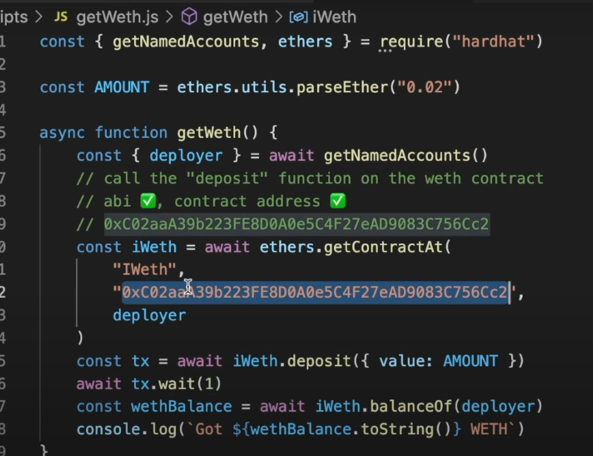

To be read - [Article](https://chain.link/education/defi)
[Article](https://chain.link/education-hub/defi-2-0)

We have to reas about aave

undestand the whole platform

uniswap protocol we can use to swap tokens

 

 after this much of code we need to know mainnet forking
 