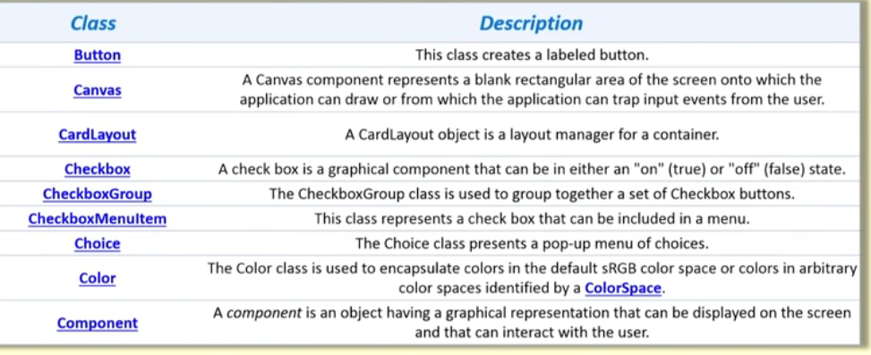
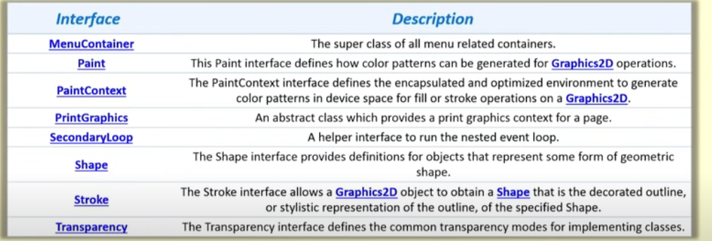

Java AWT (Abstract Window Toolkit) is an API to develop Graphical User Interface (GUI) or windows-based applications in Java. Java AWT components are platform-dependent i.e. components are displayed according to the view of operating system.  AWT is heavy weight i.e. its components are using the resources of underlying operating system (OS).

The java.awt package provides classes for AWT API such as TextField, Label, TextArea, RadioButton, CheckBox, Choice, List etc.

Java AWT calls the native platform calls the native platform (operating systems) subroutine for creating API components like TextField, ChechBox, button, etc.
For example, an AWT GUI with components like TextField, label and button will have different look and feel for the different platforms like Windows, MAC OS, and Unix. The reason for this is the platforms have different view for their native components and AWT directly calls the native subroutine that creates those components.
In simple words, an AWT application will look like a windows application in Windows OS whereas it will look like a Mac application in the MAC OS.

Components
All the elements like the button, text fields, scroll bars, etc. are called components. In Java AWT, there are classes for each component as shown in above diagram. In order to place every component in a particular position on a screen, we need to add them to a container.

Container
The Container is a component in AWT that can contain another components like buttons, textfields, labels etc. The classes that extends Container class are known as container such as Frame, Dialog and Panel.
It is basically a screen where the where the components are placed at their specific locations. Thus it contains and controls the layout of components. A cintsiner itself is component.

### Componment class

public abstract class Component
extends Object
implements ImageObserver, MenuContainer, Serializable

A component is an object having a graphical representation that can be displayed on the screen and that can interact with the user. Examples of components are the buttons, checkboxes, and scrollbars of a typical graphical user interface.

Direct Known Subclasses:
Button, Canvas, Checkbox, Choice, Container, Label, List, Scrollbar, TextComponent

All Implemented Interfaces:
ImageObserver, MenuContainer, Serializable

The Component class is the abstract superclass of the nonmenu-related Abstract Window Toolkit components. Class Component can also be extended directly to create a lightweight component. A lightweight component is a component that is not associated with a native window. On the contrary, a heavyweight component is associated with a native window. The isLightweight() method may be used to distinguish between the two kinds of the components. Lightweight and heavyweight components may be mixed in a single component hierarchy. However, for correct operating of such a mixed hierarchy of components, the whole hierarchy must be valid. When the hierarchy gets invalidated, like after changing the bounds of components, or adding/removing components to/from containers, the whole hierarchy must be validated afterwards by means of the Container.validate() method invoked on the top-most invalid container of the hierarchy.

Useful Methods of Component Class
Method	Description
public void add(Component c)	Inserts a component on this component.
public void setSize(int width,int height)	Sets the size (width and height) of the component.
public void setLayout(LayoutManager m)	Defines the layout manager for the component.
public void setVisible(boolean status)	Changes the visibility of the component, by default false.

FRAME

public class Frame
extends Window
implements MenuContainer
A Frame is a top-level window with a title and a border.
The size of the frame includes any area designated for the border. The dimensions of the border area may be obtained using the getInsets method, however, since these dimensions are platform-dependent, a valid insets value cannot be obtained until the frame is made displayable by either calling pack or show. Since the border area is included in the overall size of the frame, the border effectively obscures a portion of the frame, constraining the area available for rendering and/or displaying subcomponents to the rectangle which has an upper-left corner location of (insets.left, insets.top), and has a size of width - (insets.left + insets.right) by height - (insets.top + insets.bottom).

The default layout for a frame is BorderLayout.

A frame may have its native decorations (i.e. Frame and Titlebar) turned off with setUndecorated. This can only be done while the frame is not displayable.

In a multi-screen environment, you can create a Frame on a different screen device by constructing the Frame with Frame(GraphicsConfiguration) or Frame(String title, GraphicsConfiguration). The GraphicsConfiguration object is one of the GraphicsConfiguration objects of the target screen device.

In a virtual device multi-screen environment in which the desktop area could span multiple physical screen devices, the bounds of all configurations are relative to the virtual-coordinate system. The origin of the virtual-coordinate system is at the upper left-hand corner of the primary physical screen. De

Constructors

Constructor and Description
Frame()
Constructs a new instance of Frame that is initially invisible.
Frame(GraphicsConfiguration gc)
Constructs a new, initially invisible Frame with the specified GraphicsConfiguration.
Frame(String title)
Constructs a new, initially invisible Frame object with the specified title.
Frame(String title, GraphicsConfiguration gc)
Constructs a new, initially invisible Frame object with the specified title and a GraphicsConfiguration.

Modifier and Type	Method and Description
void	addNotify()
Makes this Frame displayable by connecting it to a native screen resource.
AccessibleContext	getAccessibleContext()
Gets the AccessibleContext associated with this Frame.
int	getCursorType()
Deprecated. 
As of JDK version 1.1, replaced by Component.getCursor().
int	getExtendedState()
Gets the state of this frame.
static Frame[]	getFrames()
Returns an array of all Frames created by this application.
Image	getIconImage()
Returns the image to be displayed as the icon for this frame.
Rectangle	getMaximizedBounds()
Gets maximized bounds for this frame.
MenuBar	getMenuBar()
Gets the menu bar for this frame.
int	getState()
Gets the state of this frame (obsolete).
String	getTitle()
Gets the title of the frame.
boolean	isResizable()
Indicates whether this frame is resizable by the user.
boolean	isUndecorated()
Indicates whether this frame is undecorated.
protected String	paramString()
Returns a string representing the state of this Frame.
void	remove(MenuComponent m)
Removes the specified menu bar from this frame.
void	removeNotify()
Makes this Frame undisplayable by removing its connection to its native screen resource.
void	setBackground(Color bgColor)
Sets the background color of this window.
void	setCursor(int cursorType)
Deprecated. 
As of JDK version 1.1, replaced by Component.setCursor(Cursor).
void	setExtendedState(int state)
Sets the state of this frame.
void	setIconImage(Image image)
Sets the image to be displayed as the icon for this window.
void	setMaximizedBounds(Rectangle bounds)
Sets the maximized bounds for this frame.
void	setMenuBar(MenuBar mb)
Sets the menu bar for this frame to the specified menu bar.
void	setOpacity(float opacity)
Sets the opacity of the window.
void	setResizable(boolean resizable)
Sets whether this frame is resizable by the user.
void	setShape(Shape shape)
Sets the shape of the window.
void	setState(int state)
Sets the state of this frame (obsolete).
void	setTitle(String title)
Sets the title for this frame to the specified string.
void	setUndecorated(boolean undecorated)
Disables or enables decorations for this frame.

Panel

public class Panel
extends Container
implements Accessible
Panel is the simplest container class. A panel provides space in which an application can attach any other component, including other panels.
The default layout manager for a panel is the FlowLayout layout manager.

Constructors 
Constructor and Description
Panel()
Creates a new panel using the default layout manager.
Panel(LayoutManager layout)
Creates a new panel with the specified layout manager.

oid	addNotify()
Creates the Panel's peer.
AccessibleContext	getAccessibleContext()
Gets the AccessibleContext associated with this Panel.

### Button

public class Button
extends Component
implements Accessible
This class creates a labeled button. The application can cause some action to happen when the button is pushed. T

The gesture of clicking on a button with the mouse is associated with one instance of ActionEvent, which is sent out when the mouse is both pressed and released over the button. If an application is interested in knowing when the button has been pressed but not released, as a separate gesture, it can specialize processMouseEvent, or it can register itself as a listener for mouse events by calling addMouseListener. Both of these methods are defined by Component, the abstract superclass of all components.

When a button is pressed and released, AWT sends an instance of ActionEvent to the button, by calling processEvent on the button. The button's processEvent method receives all events for the button; it passes an action event along by calling its own processActionEvent method. The latter method passes the action event on to any action listeners that have registered an interest in action events generated by this button.

If an application wants to perform some action based on a button being pressed and released, it should implement ActionListener and register the new listener to receive events from this button, by calling the button's addActionListener method. The application can make use of the button's action command as a messaging protocol.

Constructors 
Constructor and Description
Button()
Constructs a button with an empty string for its label.
Button(String label)
Constructs a button with the specified label.

Modifier and Type	Method and Description
void	addActionListener(ActionListener l)
Adds the specified action listener to receive action events from this button.
void	addNotify()
Creates the peer of the button.
AccessibleContext	getAccessibleContext()
Gets the AccessibleContext associated with this Button.
String	getActionCommand()
Returns the command name of the action event fired by this button.
ActionListener[]	getActionListeners()
Returns an array of all the action listeners registered on this button.
String	getLabel()
Gets the label of this button.
<T extends EventListener> 
T[]	getListeners(Class<T> listenerType)
Returns an array of all the objects currently registered as FooListeners upon this Button.
protected String	paramString()
Returns a string representing the state of this Button.
protected void	processActionEvent(ActionEvent e)
Processes action events occurring on this button by dispatching them to any registered ActionListener objects.
protected void	processEvent(AWTEvent e)
Processes events on this button.
void	removeActionListener(ActionListener l)
Removes the specified action listener so that it no longer receives action events from this button.
void	setActionCommand(String command)
Sets the command name for the action event fired by this button.
void	setLabel(String label)
Sets the button's label to be the specified string.

### Checkbox

extends Component
implements ItemSelectable, Accessible
A check box is a graphical component that can be in either an "on" (true) or "off" (false) state. Clicking on a check box changes its state from "on" to "off," or from "off" to "on."
The following code example creates a set of check boxes in a grid layout:

 setLayout(new GridLayout(3, 1));
 add(new Checkbox("one", null, true));
 add(new Checkbox("two"));
 add(new Checkbox("three"));
 

 
Constructors 
Constructor and Description
Checkbox()
Creates a check box with an empty string for its label.
Checkbox(String label)
Creates a check box with the specified label.
Checkbox(String label, boolean state)
Creates a check box with the specified label and sets the specified state.
Checkbox(String label, boolean state, CheckboxGroup group)
Constructs a Checkbox with the specified label, set to the specified state, and in the specified check box group.
Checkbox(String label, CheckboxGroup group, boolean state)
Creates a check box with the specified label, in the specified check box group, and set to the specified state.
Method Summary
Methods 
Modifier and Type	Method and Description
void	addItemListener(ItemListener l)
Adds the specified item listener to receive item events from this check box.
void	addNotify()
Creates the peer of the Checkbox.
AccessibleContext	getAccessibleContext()
Gets the AccessibleContext associated with this Checkbox.
CheckboxGroup	getCheckboxGroup()
Determines this check box's group.
ItemListener[]	getItemListeners()
Returns an array of all the item listeners registered on this checkbox.
String	getLabel()
Gets the label of this check box.
<T extends EventListener> 
T[]	getListeners(Class<T> listenerType)
Returns an array of all the objects currently registered as FooListeners upon this Checkbox.
Object[]	getSelectedObjects()
Returns an array (length 1) containing the checkbox label or null if the checkbox is not selected.
boolean	getState()
Determines whether this check box is in the "on" or "off" state.
protected String	paramString()
Returns a string representing the state of this Checkbox.
protected void	processEvent(AWTEvent e)
Processes events on this check box.
protected void	processItemEvent(ItemEvent e)
Processes item events occurring on this check box by dispatching them to any registered ItemListener objects.
void	removeItemListener(ItemListener l)
Removes the specified item listener so that the item listener no longer receives item events from this check box.
void	setCheckboxGroup(CheckboxGroup g)
Sets this check box's group to the specified check box group.
void	setLabel(String label)
Sets this check box's label to be the string argument.
void	setState(boolean state)
Sets the state of this check box to the specified state.

Text Field

public class TextField
extends TextComponent
A TextField object is a text component that allows for the editing of a single line of text.
For example, the following image depicts a frame with four text fields of varying widths. Two of these text fields display the predefined text "Hello".

TextField()
Constructs a new text field.
TextField(int columns)
Constructs a new empty text field with the specified number of columns.
TextField(String text)
Constructs a new text field initialized with the specified text.
TextField(String text, int columns)
Constructs a new text field initialized with the specified text to be displayed, and wide enough to hold the specified number of columns.
Method Summary
Methods 
Modifier and Type	Method and Description
void	addActionListener(ActionListener l)
Adds the specified action listener to receive action events from this text field.
void	addNotify()
Creates the TextField's peer.
boolean	echoCharIsSet()
Indicates whether or not this text field has a character set for echoing.
AccessibleContext	getAccessibleContext()
Gets the AccessibleContext associated with this TextField.
ActionListener[]	getActionListeners()
Returns an array of all the action listeners registered on this textfield.
int	getColumns()
Gets the number of columns in this text field.
char	getEchoChar()
Gets the character that is to be used for echoing.
<T extends EventListener> 
T[]	getListeners(Class<T> listenerType)
Returns an array of all the objects currently registered as FooListeners upon this TextField.
Dimension	getMinimumSize()
Gets the minumum dimensions for this text field.
Dimension	getMinimumSize(int columns)
Gets the minumum dimensions for a text field with the specified number of columns.
Dimension	getPreferredSize()
Gets the preferred size of this text field.
Dimension	getPreferredSize(int columns)
Gets the preferred size of this text field with the specified number of columns.
Dimension	minimumSize()
Deprecated. 
As of JDK version 1.1, replaced by getMinimumSize().
Dimension	minimumSize(int columns)
Deprecated. 
As of JDK version 1.1, replaced by getMinimumSize(int).
protected String	paramString()
Returns a string representing the state of this TextField.
Dimension	preferredSize()
Deprecated. 
As of JDK version 1.1, replaced by getPreferredSize().
Dimension	preferredSize(int columns)
Deprecated. 
As of JDK version 1.1, replaced by getPreferredSize(int).
protected void	processActionEvent(ActionEvent e)
Processes action events occurring on this text field by dispatching them to any registered ActionListener objects.
protected void	processEvent(AWTEvent e)
Processes events on this text field.
void	removeActionListener(ActionListener l)
Removes the specified action listener so that it no longer receives action events from this text field.
void	setColumns(int columns)
Sets the number of columns in this text field.
void	setEchoChar(char c)
Sets the echo character for this text field.
void	setEchoCharacter(char c)
Deprecated. 
As of JDK version 1.1, replaced by setEchoChar(char).
void	setText(String t)
Sets the text that is presented by this text component to be the specified text.

public class TextArea
extends TextComponent
A TextArea object is a multi-line region that displays text. It can be set to allow editing or to be read-only.
The following image shows the appearance of a text area:

TextArea()
Constructs a new text area with the empty string as text.
TextArea(int rows, int columns)
Constructs a new text area with the specified number of rows and columns and the empty string as text.
TextArea(String text)
Constructs a new text area with the specified text.
TextArea(String text, int rows, int columns)
Constructs a new text area with the specified text, and with the specified number of rows and columns.
TextArea(String text, int rows, int columns, int scrollbars)
Constructs a new text area with the specified text, and with the rows, columns, and scroll bar visibility as specified.

Modifier and Type	Method and Description
void	addNotify()
Creates the TextArea's peer.
void	append(String str)
Appends the given text to the text area's current text.
void	appendText(String str)
Deprecated. 
As of JDK version 1.1, replaced by append(String).
AccessibleContext	getAccessibleContext()
Returns the AccessibleContext associated with this TextArea.
int	getColumns()
Returns the number of columns in this text area.
Dimension	getMinimumSize()
Determines the minimum size of this text area.
Dimension	getMinimumSize(int rows, int columns)
Determines the minimum size of a text area with the specified number of rows and columns.
Dimension	getPreferredSize()
Determines the preferred size of this text area.
Dimension	getPreferredSize(int rows, int columns)
Determines the preferred size of a text area with the specified number of rows and columns.
int	getRows()
Returns the number of rows in the text area.
int	getScrollbarVisibility()
Returns an enumerated value that indicates which scroll bars the text area uses.
void	insert(String str, int pos)
Inserts the specified text at the specified position in this text area.
void	insertText(String str, int pos)
Deprecated. 
As of JDK version 1.1, replaced by insert(String, int).
Dimension	minimumSize()
Deprecated. 
As of JDK version 1.1, replaced by getMinimumSize().
Dimension	minimumSize(int rows, int columns)
Deprecated. 
As of JDK version 1.1, replaced by getMinimumSize(int, int).
protected String	paramString()
Returns a string representing the state of this TextArea.
Dimension	preferredSize()
Deprecated. 
As of JDK version 1.1, replaced by getPreferredSize().
Dimension	preferredSize(int rows, int columns)
Deprecated. 
As of JDK version 1.1, replaced by getPreferredSize(int, int).
void	replaceRange(String str, int start, int end)
Replaces text between the indicated start and end positions with the specified replacement text.
void	replaceText(String str, int start, int end)
Deprecated. 
As of JDK version 1.1, replaced by replaceRange(String, int, int).
void	setColumns(int columns)
Sets the number of columns for this text area.
void	setRows(int rows)
Sets the number of rows for this text area.

List

public class List
extends Component
implements ItemSelectable, Accessible
The List component presents the user with a scrolling list of text items. The list can be set up so that the user can choose either one item or multiple items.

Constructors 
Constructor and Description
List()
Creates a new scrolling list.
List(int rows)
Creates a new scrolling list initialized with the specified number of visible lines.
List(int rows, boolean multipleMode)
Creates a new scrolling list initialized to display the specified number of rows.

Methods 
Modifier and Type	Method and Description
void	add(String item)
Adds the specified item to the end of scrolling list.
void	add(String item, int index)
Adds the specified item to the the scrolling list at the position indicated by the index.
void	addActionListener(ActionListener l)
Adds the specified action listener to receive action events from this list.
void	addItem(String item)
Deprecated. 
replaced by add(String).
void	addItem(String item, int index)
Deprecated. 
replaced by add(String, int).
void	addItemListener(ItemListener l)
Adds the specified item listener to receive item events from this list.
void	addNotify()
Creates the peer for the list.
boolean	allowsMultipleSelections()
Deprecated. 
As of JDK version 1.1, replaced by isMultipleMode().
void	clear()
Deprecated. 
As of JDK version 1.1, replaced by removeAll().
int	countItems()
Deprecated. 
As of JDK version 1.1, replaced by getItemCount().
void	delItem(int position)
Deprecated. 
replaced by remove(String) and remove(int).
void	delItems(int start, int end)
Deprecated. 
As of JDK version 1.1, Not for public use in the future. This method is expected to be retained only as a package private method.
void	deselect(int index)
Deselects the item at the specified index.
AccessibleContext	getAccessibleContext()
Gets the AccessibleContext associated with this List.
ActionListener[]	getActionListeners()
Returns an array of all the action listeners registered on this list.
String	getItem(int index)
Gets the item associated with the specified index.
int	getItemCount()
Gets the number of items in the list.
ItemListener[]	getItemListeners()
Returns an array of all the item listeners registered on this list.
String[]	getItems()
Gets the items in the list.
<T extends EventListener> 
T[]	getListeners(Class<T> listenerType)
Returns an array of all the objects currently registered as FooListeners upon this List.
Dimension	getMinimumSize()
Determines the minimum size of this scrolling list.
Dimension	getMinimumSize(int rows)
Gets the minumum dimensions for a list with the specified number of rows.
Dimension	getPreferredSize()
Gets the preferred size of this scrolling list.
Dimension	getPreferredSize(int rows)
Gets the preferred dimensions for a list with the specified number of rows.
int	getRows()
Gets the number of visible lines in this list.
int	getSelectedIndex()
Gets the index of the selected item on the list,
int[]	getSelectedIndexes()
Gets the selected indexes on the list.
String	getSelectedItem()
Gets the selected item on this scrolling list.
String[]	getSelectedItems()
Gets the selected items on this scrolling list.
Object[]	getSelectedObjects()
Gets the selected items on this scrolling list in an array of Objects.
int	getVisibleIndex()
Gets the index of the item that was last made visible by the method makeVisible.
boolean	isIndexSelected(int index)
Determines if the specified item in this scrolling list is selected.
boolean	isMultipleMode()
Determines whether this list allows multiple selections.
boolean	isSelected(int index)
Deprecated. 
As of JDK version 1.1, replaced by isIndexSelected(int).
void	makeVisible(int index)
Makes the item at the specified index visible.
Dimension	minimumSize()
Deprecated. 
As of JDK version 1.1, replaced by getMinimumSize().
Dimension	minimumSize(int rows)
Deprecated. 
As of JDK version 1.1, replaced by getMinimumSize(int).
protected String	paramString()
Returns the parameter string representing the state of this scrolling list.
Dimension	preferredSize()
Deprecated. 
As of JDK version 1.1, replaced by getPreferredSize().
Dimension	preferredSize(int rows)
Deprecated. 
As of JDK version 1.1, replaced by getPreferredSize(int).
protected void	processActionEvent(ActionEvent e)
Processes action events occurring on this component by dispatching them to any registered ActionListener objects.
protected void	processEvent(AWTEvent e)
Processes events on this scrolling list.
protected void	processItemEvent(ItemEvent e)
Processes item events occurring on this list by dispatching them to any registered ItemListener objects.
void	remove(int position)
Removes the item at the specified position from this scrolling list.
void	remove(String item)
Removes the first occurrence of an item from the list.
void	removeActionListener(ActionListener l)
Removes the specified action listener so that it no longer receives action events from this list.
void	removeAll()
Removes all items from this list.
void	removeItemListener(ItemListener l)
Removes the specified item listener so that it no longer receives item events from this list.
void	removeNotify()
Removes the peer for this list.
void	replaceItem(String newValue, int index)
Replaces the item at the specified index in the scrolling list with the new string.
void	select(int index)
Selects the item at the specified index in the scrolling list.
void	setMultipleMode(boolean b)
Sets the flag that determines whether this list allows multiple selections.
void	setMultipleSelections(boolean b)
Deprecated. 

 List lst = new List(4, false);
 lst.add("Mercury");
 lst.add("Venus");
 lst.add("Earth");
 lst.add("JavaSoft");
 lst.add("Mars");
 lst.add("Jupiter");
 lst.add("Saturn");
 lst.add("Uranus");
 lst.add("Neptune");
 lst.add("Pluto");
 cnt.add(lst);

 If the List allows multiple selections, then clicking on an item that is already selected deselects it. In the preceding example, only one item from the scrolling list can be selected at a time, since the second argument when creating the new scrolling list is false. If the List does not allow multiple selections, selecting an item causes any other selected item to be deselected.

 public class Choice
extends Component
implements ItemSelectable, Accessible
The Choice class presents a pop-up menu of choices. The current choice is displayed as the title of the menu.
The following code example produces a pop-up menu:

 Choice ColorChooser = new Choice();
 ColorChooser.add("Green");
 ColorChooser.add("Red");
 ColorChooser.add("Blue");
 
 Constructor and Description
Choice()
Creates a new choice menu.
Method Summary
Methods 
Modifier and Type	Method and Description
void	add(String item)
Adds an item to this Choice menu.
void	addItem(String item)
Obsolete as of Java 2 platform v1.1.
void	addItemListener(ItemListener l)
Adds the specified item listener to receive item events from this Choice menu.
void	addNotify()
Creates the Choice's peer.
int	countItems()
Deprecated. 
As of JDK version 1.1, replaced by getItemCount().
AccessibleContext	getAccessibleContext()
Gets the AccessibleContext associated with this Choice.
String	getItem(int index)
Gets the string at the specified index in this Choice menu.
int	getItemCount()
Returns the number of items in this Choice menu.
ItemListener[]	getItemListeners()
Returns an array of all the item listeners registered on this choice.
<T extends EventListener> 
T[]	getListeners(Class<T> listenerType)
Returns an array of all the objects currently registered as FooListeners upon this Choice.
int	getSelectedIndex()
Returns the index of the currently selected item.
String	getSelectedItem()
Gets a representation of the current choice as a string.
Object[]	getSelectedObjects()
Returns an array (length 1) containing the currently selected item.
void	insert(String item, int index)
Inserts the item into this choice at the specified position.
protected String	paramString()
Returns a string representing the state of this Choice menu.
protected void	processEvent(AWTEvent e)
Processes events on this choice.
protected void	processItemEvent(ItemEvent e)
Processes item events occurring on this Choice menu by dispatching them to any registered ItemListener objects.
void	remove(int position)
Removes an item from the choice menu at the specified position.
void	remove(String item)
Removes the first occurrence of item from the Choice menu.
void	removeAll()
Removes all items from the choice menu.
void	removeItemListener(ItemListener l)
Removes the specified item listener so that it no longer receives item events from this Choice menu.
void	select(int pos)
Sets the selected item in this Choice menu to be the item at the specified position.
void	select(String str)
Sets the selected item in this Choice menu to be the item whose name is equal to the specified string.

public class Scrollbar
extends Component
implements Adjustable, Accessible
The Scrollbar class embodies a scroll bar, a familiar user-interface object. A scroll bar provides a convenient means for allowing a user to select from a range of values. The following three vertical scroll bars could be used as slider controls to pick the red, green, and blue components of a color:

Each scroll bar in this example could be created with code similar to the following:

 redSlider=new Scrollbar(Scrollbar.VERTICAL, 0, 1, 0, 255);
 add(redSlider);

 Constructor and Description
Scrollbar()
Constructs a new vertical scroll bar.
Scrollbar(int orientation)
Constructs a new scroll bar with the specified orientation.
Scrollbar(int orientation, int value, int visible, int minimum, int maximum)
Constructs a new scroll bar with the specified orientation, initial value, visible amount, and minimum and maximum values.

Methods 
Modifier and Type	Method and Description
void	addAdjustmentListener(AdjustmentListener l)
Adds the specified adjustment listener to receive instances of AdjustmentEvent from this scroll bar.
void	addNotify()
Creates the Scrollbar's peer.
AccessibleContext	getAccessibleContext()
Gets the AccessibleContext associated with this Scrollbar.
AdjustmentListener[]	getAdjustmentListeners()
Returns an array of all the adjustment listeners registered on this scrollbar.
int	getBlockIncrement()
Gets the block increment of this scroll bar.
int	getLineIncrement()
Deprecated. 
As of JDK version 1.1, replaced by getUnitIncrement().
<T extends EventListener> 
T[]	getListeners(Class<T> listenerType)
Returns an array of all the objects currently registered as FooListeners upon this Scrollbar.
int	getMaximum()
Gets the maximum value of this scroll bar.
int	getMinimum()
Gets the minimum value of this scroll bar.
int	getOrientation()
Returns the orientation of this scroll bar.
int	getPageIncrement()
Deprecated. 
As of JDK version 1.1, replaced by getBlockIncrement().
int	getUnitIncrement()
Gets the unit increment for this scrollbar.
int	getValue()
Gets the current value of this scroll bar.
boolean	getValueIsAdjusting()
Returns true if the value is in the process of changing as a result of actions being taken by the user.
int	getVisible()
Deprecated. 
As of JDK version 1.1, replaced by getVisibleAmount().
int	getVisibleAmount()
Gets the visible amount of this scroll bar.
protected String	paramString()
Returns a string representing the state of this Scrollbar.
protected void	processAdjustmentEvent(AdjustmentEvent e)
Processes adjustment events occurring on this scrollbar by dispatching them to any registered AdjustmentListener objects.
protected void	processEvent(AWTEvent e)
Processes events on this scroll bar.
void	removeAdjustmentListener(AdjustmentListener l)
Removes the specified adjustment listener so that it no longer receives instances of AdjustmentEvent from this scroll bar.
void	setBlockIncrement(int v)
Sets the block increment for this scroll bar.
void	setLineIncrement(int v)
Deprecated. 
As of JDK version 1.1, replaced by setUnitIncrement(int).
void	setMaximum(int newMaximum)
Sets the maximum value of this scroll bar.
void	setMinimum(int newMinimum)
Sets the minimum value of this scroll bar.
void	setOrientation(int orientation)
Sets the orientation for this scroll bar.
void	setPageIncrement(int v)
Deprecated. 
As of JDK version 1.1, replaced by setBlockIncrement().
void	setUnitIncrement(int v)
Sets the unit increment for this scroll bar.
void	setValue(int newValue)
Sets the value of this scroll bar to the specified value.
void	setValueIsAdjusting(boolean b)
Sets the valueIsAdjusting property.
void	setValues(int value, int visible, int minimum, int maximum)
Sets the values of four properties for this scroll bar: value, visibleAmount, minimum, and maximum.
void	setVisibleAmount(int newAmount)
Sets the visible amount of this scroll bar