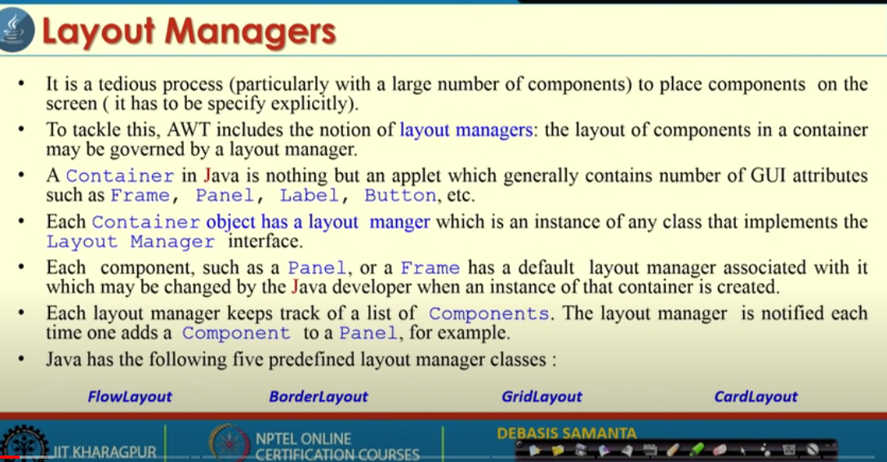

public interface LayoutManager
Defines the interface for classes that know how to lay out Containers.
Swing's painting architecture assumes the children of a JComponent do not overlap. If a JComponent's LayoutManager allows children to overlap, the JComponent must override isOptimizedDrawingEnabled to return false.

The LayoutManagers are used to arrange components in a particular manner. The Java LayoutManagers facilitates us to control the positioning and size of the components in GUI forms. LayoutManager is an interface that is implemented by all the classes of layout managers. There are the following classes that represent the layout managers:

java.awt.BorderLayout
java.awt.FlowLayout
java.awt.GridLayout
java.awt.CardLayout
java.awt.GridBagLayout
javax.swing.BoxLayout
javax.swing.GroupLayout
javax.swing.ScrollPaneLayout
javax.swing.SpringLayout etc.


public abstract class Graphics
extends Object
The Graphics class is the abstract base class for all graphics contexts that allow an application to draw onto components that are realized on various devices, as well as onto off-screen images.
A Graphics object encapsulates state information needed for the basic rendering operations that Java supports. This state information includes the following properties:

The Component object on which to draw.
A translation origin for rendering and clipping coordinates.
The current clip.
The current color.
The current font.
The current logical pixel operation function (XOR or Paint).
The current XOR alternation color (see setXORMode(java.awt.Color)).


Method Detail
addLayoutComponent
void addLayoutComponent(String name,
                      Component comp)
If the layout manager uses a per-component string, adds the component comp to the layout, associating it with the string specified by name.
Parameters:
name - the string to be associated with the component
comp - the component to be added
removeLayoutComponent
void removeLayoutComponent(Component comp)
Removes the specified component from the layout.
Parameters:
comp - the component to be removed
preferredLayoutSize
Dimension preferredLayoutSize(Container parent)
Calculates the preferred size dimensions for the specified container, given the components it contains.
Parameters:
parent - the container to be laid out
See Also:
minimumLayoutSize(java.awt.Container)
minimumLayoutSize
Dimension minimumLayoutSize(Container parent)
Calculates the minimum size dimensions for the specified container, given the components it contains.
Parameters:
parent - the component to be laid out
See Also:
preferredLayoutSize(java.awt.Container)
layoutContainer
void layoutContainer(Container parent)
Lays out the specified container.
Parameters:
parent - the container to be laid out


FLOW LAYOUT

he Java FlowLayout class is used to arrange the components in a line, one after another (in a flow). It is the default layout of the applet or panel.

Fields of FlowLayout class
public static final int LEFT
public static final int RIGHT
public static final int CENTER
public static final int LEADING
public static final int TRAILING


Constructors of FlowLayout class
FlowLayout(): creates a flow layout with centered alignment and a default 5 unit horizontal and vertical gap.
FlowLayout(int align): creates a flow layout with the given alignment and a default 5 unit horizontal and vertical gap.
FlowLayout(int align, int hgap, int vgap): creates a flow layout with the given alignment and the given horizontal and vertical gap.


Example of FlowLayout class: Using FlowLayout() constructor
FileName: FlowLayoutExample.java

```java
import java.awt.*;

public class Main{
    Frame f;
    Main(){
        f = new Frame();
        Button b1 = new Button("1");
        Button b2 = new Button("2");
        Button b3 = new Button("3");
        Button b4 = new Button("4");
        Button b5 = new Button("5");

        f.add(b1);
        f.add(b2);
        f.add(b3);
        f.add(b4);
        f.add(b5);

        f.setLayout(new FlowLayout(FlowLayout.RIGHT));
        f.setSize(300, 300);
        f.setVisible(true);
    }

    public static void main(String[] args) {
        new Main();
    }
}
```

Java BorderLayout
The BorderLayout is used to arrange the components in five regions: north, south, east, west, and center. Each region (area) may contain one component only. It is the default layout of a frame or window. The BorderLayout provides five constants for each region:

public static final int NORTH
public static final int SOUTH
public static final int EAST
public static final int WEST
public static final int CENTER
Constructors of BorderLayout class:
BorderLayout(): creates a border layout but with no gaps between the components.
BorderLayout(int hgap, int vgap): creates a border layout with the given horizontal and vertical gaps between the components.
Example of BorderLayout class: Using BorderLayout() constructor
FileName: Border.java


```java
import java.awt.*;

public class x{
    Frame f;
    x(){
        f = new Frame();
        Button b1 = new Button("1");
        Button b2 = new Button("2");
        Button b3 = new Button("3");
        Button b4 = new Button("4");
        Button b5 = new Button("5");

        f.add(b1,BorderLayout.NORTH);
        f.add(b2,BorderLayout.SOUTH);
        f.add(b3,BorderLayout.EAST);
        f.add(b4,BorderLayout.WEST);
        f.add(b5,BorderLayout.CENTER);

        
        f.setSize(300, 300);
        f.setVisible(true);
    }

    public static void main(String[] args) {
        new x();
    }
}


```


The Java GridLayout class is used to arrange the components in a rectangular grid. One component is displayed in each rectangle.

Constructors of GridLayout class
GridLayout(): creates a grid layout with one column per component in a row.
GridLayout(int rows, int columns): creates a grid layout with the given rows and columns but no gaps between the components.
GridLayout(int rows, int columns, int hgap, int vgap): creates a grid layout with the given rows and columns along with given horizontal and vertical gaps.
Example of GridLayout class: Using GridLayout() Constructor
The GridLayout() constructor creates only one row. The following example shows the usage of the parameterless constructor.

```java
import java.awt.*;

public class x{
    Frame f;
    x(){
        f = new Frame();
        Button b1 = new Button("1");
        Button b2 = new Button("2");
        Button b3 = new Button("3");
        Button b4 = new Button("4");
        Button b5 = new Button("5");

        f.add(b1);
        f.add(b2);
        f.add(b3);
        f.add(b4);
        f.add(b5);

        f.setLayout(new GridLayout(3, 3, 2, 3));
        f.setSize(300, 300);
        f.setVisible(true);
    }

    public static void main(String[] args) {
        new x();
    }
}


```


The Java CardLayout class manages the components in such a manner that only one component is visible at a time. It treats each component as a card that is why it is known as CardLayout.

Constructors of CardLayout Class
CardLayout(): creates a card layout with zero horizontal and vertical gap.
CardLayout(int hgap, int vgap): creates a card layout with the given horizontal and vertical gap.
Commonly Used Methods of CardLayout Class
public void next(Container parent): is used to flip to the next card of the given container.
public void previous(Container parent): is used to flip to the previous card of the given container.
public void first(Container parent): is used to flip to the first card of the given container.
public void last(Container parent): is used to flip to the last card of the given container.
public void show(Container parent, String name): is used to flip to the specified card with the given name.


```java
import java.awt.*;

import java.awt.*;

public class x extends java.applet.Applet {
    CardLayout layout;

    public void init(){
        layout = new CardLayout();
        setLayout(layout);
        add("1", new Button("1"));
        add("2", new Button("2"));
        add("3", new Button("3"));
        add("4", new Button("4"));
        add("5", new Button("5"));
    }

    public boolean keyDown(Event e, int key){
        layout.next(this);
        return true;
    }
 
    public static void main(String[] args) {
        Frame f = new Frame("CardLayout");
        x applet = new x();
        applet.init();
        applet.start();
        f.add("Center", applet);
        f.resize(200, 200);
        f.show();
    }
}
```


