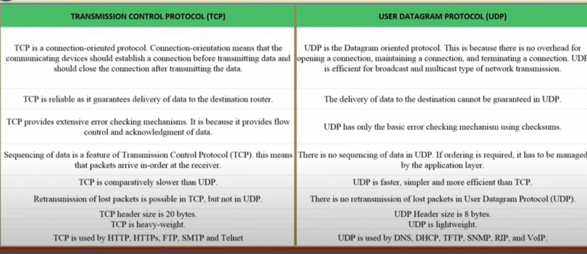

## Networking

Networking is the process of connecting 2 or more computing devices together so that data and resources can be shared. 

Terms related to networking are:

###### LAN-MAN-WAN

- A LAN (Local Area Network) is a group of computers and netwroking devices together withing the same building. Connections must be high speed and relatively inexpensive.
- A MAN (Metropolitan Area Network) is a larger network that usually spans several buildings in the same city or town. Example: Cable TV network.
- A WAN (Wide Area Network) is not restricted to a geographical location, although it might be confined within the bounds of a state or country. It is high speed and realtively expensive. Example: The Internet.

###### WWW

World Wide Web is also caleed the Web and W3, is an information space where documents and other web resources are identified by Uniform Resource Locators (URLs), interlinked by hypertext links, and can be accessed via the Internet. 

###### IP Address

IP Address is a unique number assigned to a node of a network, for example - 192.168.0.1. It is composed of  octets, each of which is an 8-bit number (0-255). It is a logical address that can be changed.

###### Port Number

The port number is used to uniquely identify different applications. It acts as a communication endpoint between applications. The port number is associated with the IP address for communication between two applications.

###### URL

URL stands for Uniform Resource Locator. It is defined as the global address of documents and other resources on the World Wide Web. For example, https://www.google.com/ is a URL.

- The first part of the URL is called a protocol identifier and it indicates what protocol to use. In this example it is http:// which stands for HyperText Transfer Protocol.
- The next part is called a resource name and it specifies the IP address or the domain name where the resource is located. The domain name for Google is www.google.com.
- The last part is optional and it specifies the path name to the resource file that has to be fetched from the web server. In this example, it is /.
- The protocol identifier and the resource name are separated by a colon and two forward slashes. The resource name and the path name are separated by a single forward slash.

###### MAC Address

MAC Address stands for Media Access Control Address. It is a unique identifier of NIC (Network Interface Controller). A network node can have multiple NIC but each with a unique MAC address. 

###### Socket

A socket is an application program responsible for communication between two end points. It is uniquely identified by an IP address and a port number.  It is a software element and does not have a physical existence (hardware).

## Communication Protocols

Communication protocols are formal descriptions of digital message formats and rules. They are required to exchange messages in or between computing systems. These are -
- Connection-less protocol (UDP - User Datagram Protocol)
- Connection-oriented protocol (TCP - Transmission Control Protocol)
- TCP-IP (Internet Protocol)
- FTP (File Transfer Protocol)
- SMTP (Simple Mail Transfer Protocol)
- HTTP (HyperText Transfer Protocol)
- HTTPS (HyperText Transfer Protocol Secure)

###### Connection-less protocol 

In connection-less protocol, the message is sent from the source to the destination without establishing a connection. It is also called datagram communication. It is fast but unreliable because no acknowledgement is received from the destination. It is used for streaming audio and video, DNS, DHCP, etc. Example: UDP.

###### Connection-oriented protocol

In connection-oriented protocol, the connection is established between the source and the destination before sending the message. It is reliable but is slow because acknowledgement is received from the destination. It is used for file transfer, email, etc. Example: TCP.

###### TCP-IP

Tranmission Control Protocol(TCP) - It is known to provide reliable and error-free communication between end systems. It performs sequencing and segmentation of data. It also has acknowledgement feature and controls the flow of data through flow control mechanism. It is very efficient but has a lot of overhead. Increased overhead leads to increased cost.

Internet Protocol(IP) - It is responsible for delivering packets from the source to the destination by looking at the IP addresses in the packet headers. It has 2 versions - IPv4 and IPv6. IPv4 is 32-bit and IPv6 is 128-bit. IPv4 is the most widely used protocol but IPv6 is gaining popularity due to the shortage of IPv4 addresses.

###### HTTP

It means HyperText Transfer Protocol. It is underlying protocol used by the World Wide Web. It defines how messages are formatted and transmitted, and what actions Web servers and browsers should take in response to various commands. 

###### HTTPS

It means HyperText Transfer Protocol Secure. It is an extension of HTTP. It is used for secure communication over a computer network. It means all communications between your browser and the website are encrypted.

| Parameter | HTTP | FTP | SMTP |
| --- | --- | --- | --- |
| Port Number | 80 | 20,21 | 25 |
| Types of band transfer | Inband | Outband | Inband |
| State | Stateless | Maintains state | - |
| Number of TCP connections | 1 | 2 (Data conn & Control conn) | 1 |
| Types of TCP connections | Can use both persistent and non-persistent | Persistent for control connection and non-persistent for data connection | Persistent |
| Types of Protocol | Pull | - | Push |
| Types of data transfer | Between client and server | Between 2 computers | Transfer mail via mail server |

## TCP vs UDP

## Protocols 

Layer	Name	Protocols
Layer 7	Application	SMTP, HTTP, FTP, POP3, SNMP
Layer 6	Presentation	MPEG, ASCH, SSL, TLS
Layer 5	Session	NetBIOS, SAP
Layer 4	Transport	TCP, UDP
Layer 3	Network	IPV5, IPV6, ICMP, IPSEC, ARP, MPLS.
Layer 2	Data Link	RAPA, PPP, Frame Relay, ATM, Fiber Cable, etc.
Layer 1	Physical	RS232, 100BaseTX, ISDN, 11.

